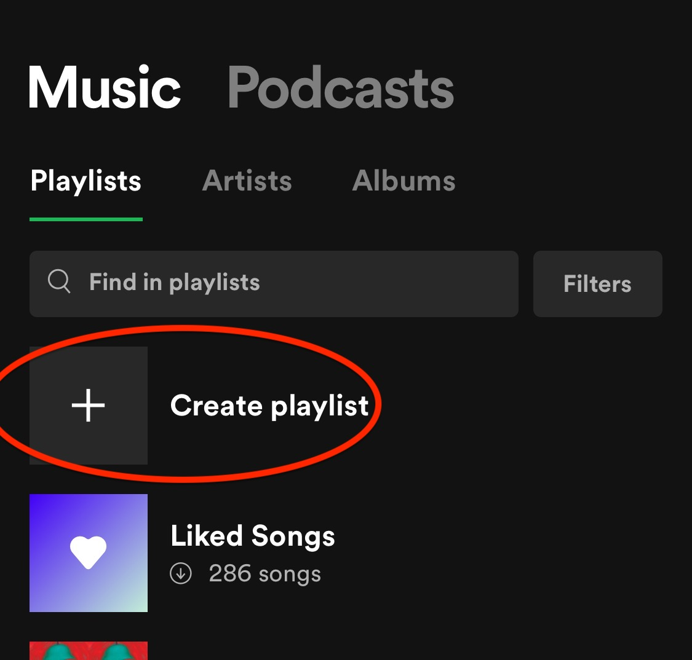

.. role:: green
.. role:: olive
.. role:: it
.. role:: small
.. role:: large

**************************
**Using Spotify**   |icon|
**************************

Purpose 
#######

The purpose of this document is to provide ways for you to setup and utilize the Spotify application to get the most enjoyable experience out of it.

Target Audience
###############

This document is for anyone of any age living in the U.S who has a passion for listening to music. They should have the financial means to pay a small monthly fee for their Spotify subscription and a device like a smartphone, PC or MacBook on which to download the application.

What you will need:
###################

            * Smartphone or laptop with an appstore (for downloading Spotify)
            * A pair of headphones
            * A steady source of income to pay for Spotify premium
                #. $4.99/month (for college students)
                #. or $9.99/month (for non-students)
            * A credit/debit card or Paypal

            |
            |

**Download Spotify onto your device**
=====================================

:it:`For laptops`
--------------------
Go to the Spotify website and download the application --> `Spotify download <https://www.spotify.com/us/download/other/>`_

:it:`For smartphones`
---------------------
Go to the appstore, search for "Spotify" and download the application called "Spotify: Music and Podcasts."
For **Android**, go to the "Google play store," find Spotify and click "Install." For **iPhone**, go to the "App Store," find Spotify and click "GET."
    
|
            
            .. image:: Pictures/spotify_appstore.png
                :width: 400
                :height: 400
                :align: center
                :alt: spotify in appstore

            |

**Select a payment plan and sign up**
======================================

Pick a Spotify Premium subscription plan
----------------------------------------
|

* **Student plan: $4.99/month**
* **Individual plan: $9.99/month**
* **Family plan up to 6 people: $14.99/month**

|

Create a Spotify account that you can sign up with a subscription plan
----------------------------------------------------------------------
|

#. Go to the Spotify website and create a Spotify account with your email and Spotify password, or if you have a smartphone, you can choose to sign up through the app you've downloaded
#. Login to your personal email account you signed up with and click on the link from the Spotify email to confirm your address
#. Then, go to the Spotify Premium website, click "Get Started" on one of the subscription plans and login with your user and password.
#. When it asks for your payment method, enter your credit/debit card or PayPal details.
                

        .. figure:: Pictures/spotify_plans.png
            :width: 500
            :align: center
            :alt: spotify subscription plans

            Spotify Premium subscription plans
            
            |

**Start using your Spotify application to customize playlists**
===============================================================

|

Create playlists
----------------

    #. On your phone, navigate to "Your Library" on the bottom and "Playlists" on the top and click on "Create playlists." On your laptop, just click on "New Playlist" on the left.
    #. Enter a name for your playlist in the popup window

    |

             

    find the "+" button

.. tip:: *Some ideal topics for your playlist name include a particular band, singer, genre (hip hop, reggae), decade (70s, 80s, 90s), activity (workout music, study playlist), or personal mood (happy, fun, relaxing music).*

|

Add songs to your playlist
--------------------------

#. :large:`Search for music by clicking on the "Search" icon at the bottom of the application on your phone or at the top on your laptop.`
#. In the search field, enter the artists, albums, or song names you're interested in to pull up playlists and songs.

                    .. figure:: Pictures/spotify_this_is_artist_playlist.png
                        :width: 400
                        :height: 500
                        :alt: finding artist playlist with most songs
                        
                        this playlist has more songs by the artist

    .. tip::
        * *Playlists with the name "This is {artist name searched}" tend to have a long list of the artist's biggest hits.*
        * *Playlists with just the artists name tend to have their top 5 popular songs and a "see discography" link below to see all their album's playlists.*

|

#. Once you enter a playlist, you can click on a song to start playing it.
#. If you want, add the song to your playlist by clicking on the three dots next to the song, "..." and clicking on the "Add to playlist" option, then select your newly created playlist in the drop-down list of all your personal playlists.

                .. figure:: Pictures/spotify_add_to_playlist.jpg
                    :width: 300
                    :height: 300
                    :align: center
                    :alt: finding artist playlist with most songs
                 
                    click the three dots and select add to playlist

#. Click the “like” option with the heart icon if you simply like the song and want to save it for later, but aren’t ready to add to any playlists. 

.. tip::
        * *You can click the three dots next to the song, “...” and click the “Like” option with the heart icon.*
        * *The heart icon is also available on the song screen, which you get if that song is currently playing and you click on the bar with the song title below.*
        * *If you later decide you want to add this song to a playlist, go to “Your Library” and “Playlists” and click on the top playlist “Liked Songs” where you can find the song you had liked previously.*

Shuffle your songs, queue them, or repeat them
----------------------------------------------

#. On your phone, click on one song in your playlist and click on the song title bar to open up the song’s display page
#. To shuffle, click on the icon with intertwined arrows
#. To play through each song consecutively, click on the icon with circular arrows
#. To repeat one song, click twice on the icon with circular arrows until a “1” shows up on the icon
#. To queue your songs in a random order, click on the three dots next to the song title in the playlist and click on the “add to queue” option. Repeat this for every song you want to hear. 

                    .. image:: ./Pictures/spotify_shuffle.jpg
                        :width: 300
                        :align: center
                        :alt: button for creating playlist

Download your playlists to listen offline
-----------------------------------------

In your playlist you can move the Download toggle to the right above the song list to download the whole playlist

            * *Listen to your downloaded music on a flight, somewhere with no internet access, or if you don’t want to use data.*

                    .. figure:: ./Pictures/spotify_download.png
                        :width: 500
                        :height: 500
                        :align: center
                        :alt: button for creating playlist

                        move download toggle to right

                        |

.. topic:: Final thoughts

    Now you should be ready to start customizing your playlists for the ultimate listening experience! For personalized playlists from Spotify, visit the “Home” tab on the bottom. To explore more genres, radios and podcasts, try visiting the “Search” tab on the bottom. Use your knowledge to build playlists according to your daytime activities like studying, working, exercising or relaxing. Distribute songs from your “Liked Songs” playlist to your desired personal playlists. Then, queue songs in your playlists in the order you like to hear them. Hopefully this tutorial has allowed you grow your passion for listening to music by keeping track of your most loved songs and helping you discover new favorites.

|
        An example of using :green:`interpreted text`

